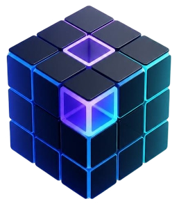
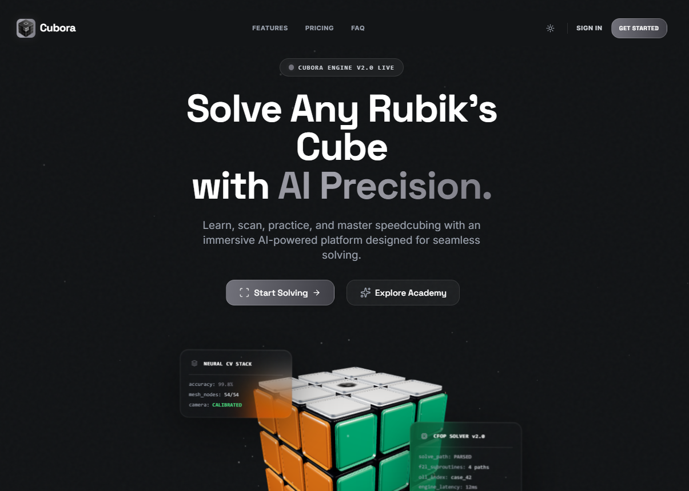

#  Cubora | AI-Powered Speedcubing Ecosystem



> **Cubora** is a premium, cinematic, full-stack AI SaaS platform designed for speedcubers of all skill levels. From a 3D-interactive solving engine and real-time computer vision cube scanner to personalized AI coaching, high-precision practice sessions, multiplayer racing, and community hubs, Cubora is the ultimate modern ecosystem to learn, practice, and master the Rubik's Cube.

---

## 🚀 Core Features & Implementation

### 📸 1. Computer Vision (OpenCV) Cube Scanner
* **Guided Sequence Scanning**: Step-by-step guidance scanning all six faces (`Front`, `Right`, `Back`, `Left`, `Top`, `Bottom`) with clear spatial rotation indicators.
* **OpenCV Real-Time Color Detection**: Utilizes `@techstark/opencv-js` in a multi-threaded web environment to analyze live video feed frames, mapping grid centers dynamically.
* **Futuristic HUD Overlay**: Real-time analytical telemetry including a sci-fi scanning matrix grid sweep, frames-per-second (FPS) monitoring, and color confidence ratings.
* **Geometrical Cube Validation**: Integrates a robust `CubeValidator` checking edge counts, corner patterns, and color frequencies to detect illegal cube configurations before submitting.

### 🎨 2. Manual Color Correction
* **Interactive 3D Grid Override**: An intuitive, fully responsive grid editor where users can override any sticker colors if lighting conditions skew computer vision.
* **Live Constraint Validation**: Constantly recalculates and displays the exact count of each color (W, Y, G, B, R, O) and alerts the user if the configuration is unsolvable.

### 🧩 3. 3D Solver Showcase & Interactive Playback
* **Interactive 3D Render**: Developed using `@react-three/fiber` and `@react-three/drei` (Three.js), rendering a smooth, fully customizable 3D Rubik's Cube.
* **Optimal Kociemba Algorithm**: Backend solver integrates the `cubejs` engine to calculate the direct mathematical path to solution in minimal moves.
* **Advanced Playback Controls**: Full control over playback (Play, Pause, Step Forward, Step Backward, Speed adjustment slider) with step-by-step phase explanations.

### ⏱️ 4. High-Precision Speedcubing Timer
* **Precise WCA Inspection Flow**: Conforms to official World Cube Association standards with a 15-second inspection countdown, penalty triggers (`+2` or `DNF`), and voice alerts at 8 and 12 seconds.
* **Virtual Scramble Preview**: Generates random-state scrambles with a dynamic 2D flat-map preview matching the exact state of the scrambled cube.
* **Session Analytics & Splits**: Tracks solve times, phase splits (e.g. CFOP stages), and calculates rolling averages (Ao5, Ao12, Ao50, Ao100), best/worst times, and session deviation.

### 🎓 5. Cube Academy & Interactive Lessons
* **Curated Learning Tracks**: Multi-stage courses ranging from the **Beginner Layer-by-Layer Method**, **Simplified CFOP (4-Look Last Layer)**, **CFOP Mastery (Cross, F2L, OLL, PLL)**, **Roux Method**, to the **ZZ Method**.
* **Algorithm Player**: Step-by-step interactive solver for every tutorial algorithm so users can visualize transitions.

### 🧠 6. AI Speedcubing Coach
* **Dynamic Performance Insights**: Processes user solve history to identify personal bottlenecks (e.g., *Cross Construction Speed*, *F2L Lookahead Pauses*, *OLL Recognition Speed*).
* **Targeted Training Drills**: Recommends customized drills with estimated time commitments and expected Return on Investment (ROI) based on consistency.

### ⚔️ 7. Simulated Multiplayer Racing
* **Elo-Based Matchmaking**: Simulated queueing system matches speedcubers with similar ELO ratings.
* **Real-Time Race Simulation**: Track opponent phase completions (e.g. *Cross*, *F2L*, *OLL*, *PLL*) dynamically in a side-by-side HUD.

### 👥 8. Community Hub & Achievements
* **Social Solve Feed**: Create posts to share record-breaking solves, algorithms, or start general discussions.
* **Profile Achievements**: Tracks milestones (e.g. *Sub-30 Pioneer*, *Century Halfway*, *First Contact*) using common, rare, epic, and legendary rarity tags.

---

## 🛠️ Tech Stack & Architecture

### Frontend (Client)
* **Framework**: React 19 (TypeScript)
* **Build System**: Vite 8
* **Styling**: Tailwind CSS & Vanilla CSS (frosted glassmorphic panels, glowing AI themes)
* **Animations**: Framer Motion 12 (spring physics & custom transitions)
* **3D Graphics**: Three.js, React Three Fiber, React Three Drei
* **Data Visualization**: Recharts (gradient areas, tooltips)
* **Audio Alerts**: High-precision cubing voice cues (`8s.m4a`, `12s.m4a`, `cheer.mp3`)
* **Computer Vision**: `@techstark/opencv-js`

### Backend (Server)
* **Runtime**: Node.js & Express
* **Database**: MongoDB & Mongoose
* **Solver Logic**: `cubejs` (Kociemba algorithm)
* **Security & Optimization**: JWT Authentication, Bcryptjs, Helmet, Express Rate Limit, Express Mongo Sanitize, CORS.

---

## 📂 Project Directory Structure

```text
cubora/
├── public/                 # Static assets (Avatars, icons, audio, OpenCV binary, cover.png)
├── src/
│   ├── animations/         # Framer motion variants and physics config
│   ├── assets/             # Images and design resources
│   ├── components/         # Reusable widgets (3D Cube, Academy, Auth, UI, Layout)
│   ├── context/            # Auth, Solver state, and Light/Dark Theme contexts
│   ├── data/               # Course structures, algorithm datasets, mock ELO parameters
│   ├── hooks/              # Custom hooks (Camera feed, WCA Timer, playback, reduced motion)
│   ├── layouts/            # Dashboard and Main layouts
│   ├── pages/              # Landing page, Scanner, Practice, AI Coach, Multiplayer, etc.
│   ├── services/           # OpenCV initialization, color detectors
│   ├── utils/              # Cubing calculators, scramble generators, validator rules
│   ├── App.tsx             # Application routing with lazy-loaded modules
│   └── main.tsx            # React client entrypoint
│
└── cubora-backend/         # Node.js/Express API server
    ├── src/
    │   ├── config/         # MongoDB initialization
    │   ├── controllers/    # Route controllers (auth, solver, solves, achievements)
    │   ├── middleware/     # JWT verification, request sanitizers
    │   ├── models/         # Mongoose schemas
    │   ├── routes/         # Express API routes
    │   └── services/       # Kociemba solver wrapper
```

---

## 💻 Installation & Setup

### Prerequisites
* [Node.js](https://nodejs.org/) (v18+ recommended)
* [MongoDB](https://www.mongodb.com/) (running instance locally or Atlas)

### Setup Frontend
1. Navigate to the root directory:
   ```bash
   cd cubora
   ```
2. Install dependencies:
   ```bash
   npm install
   ```
3. Set up environment variables (`.env`):
   ```env
   VITE_API_URL=http://localhost:5000/api
   ```
4. Start development server:
   ```bash
   npm run dev
   ```

### Setup Backend
1. Navigate to the backend directory:
   ```bash
   cd cubora-backend
   ```
2. Install dependencies:
   ```bash
   npm install
   ```
3. Set up environment variables (`.env`):
   ```env
   PORT=5000
   MONGO_URI=mongodb://localhost:27017/cubora
   JWT_SECRET=your_jwt_secret_key_here
   ```
4. Start backend server:
   * **Development** (auto-restart with Nodemon):
     ```bash
     npm run dev
     ```
   * **Production**:
     ```bash
     npm start
     ```

